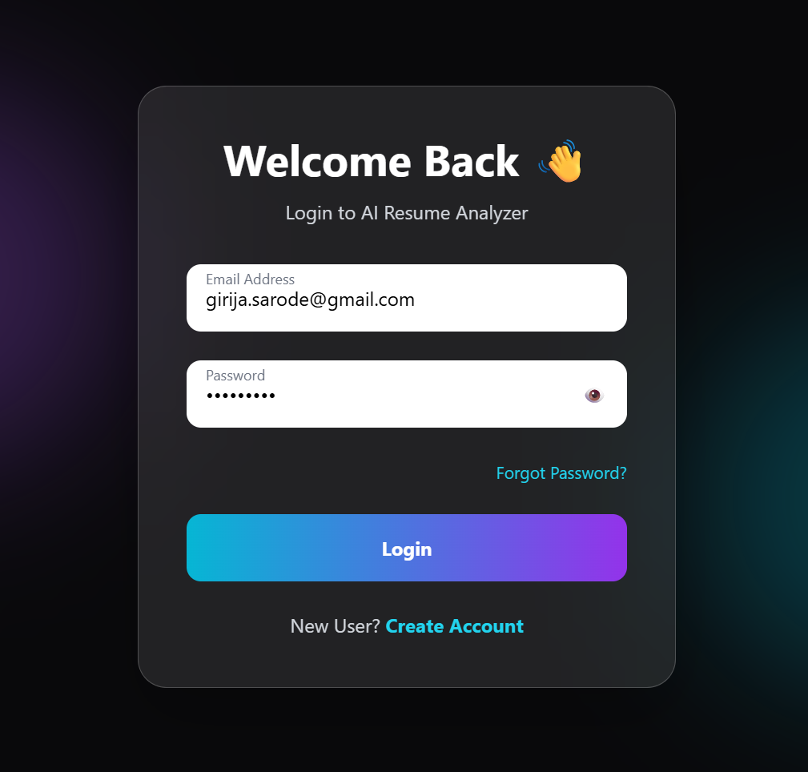
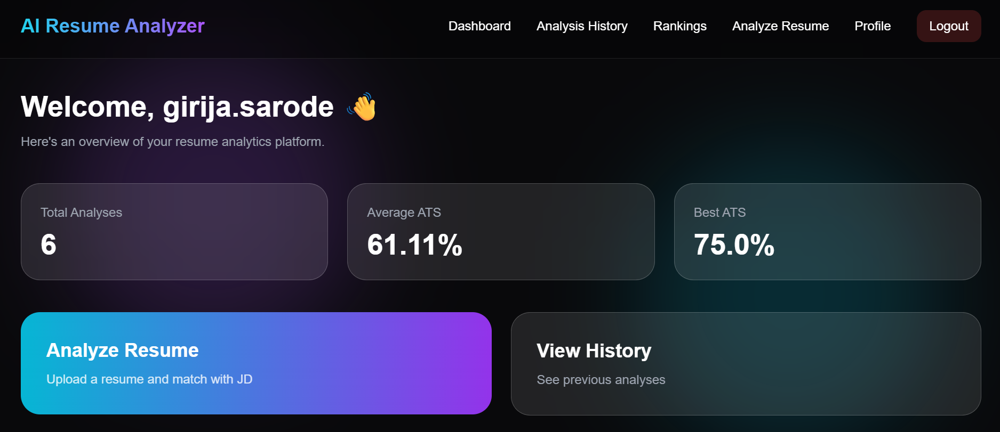
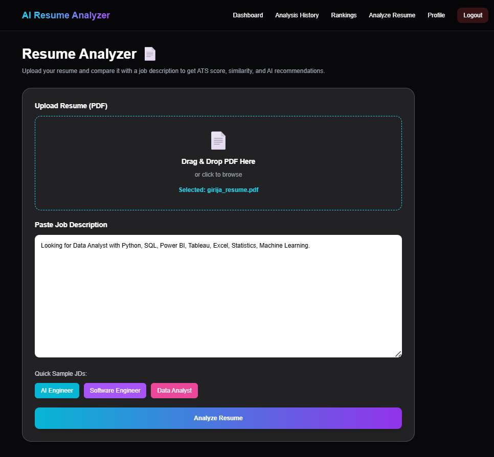
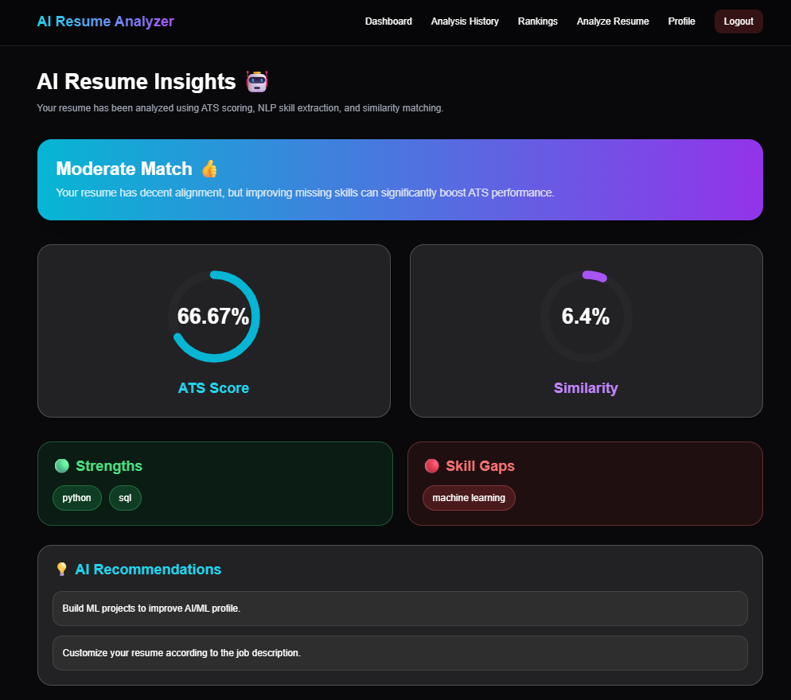
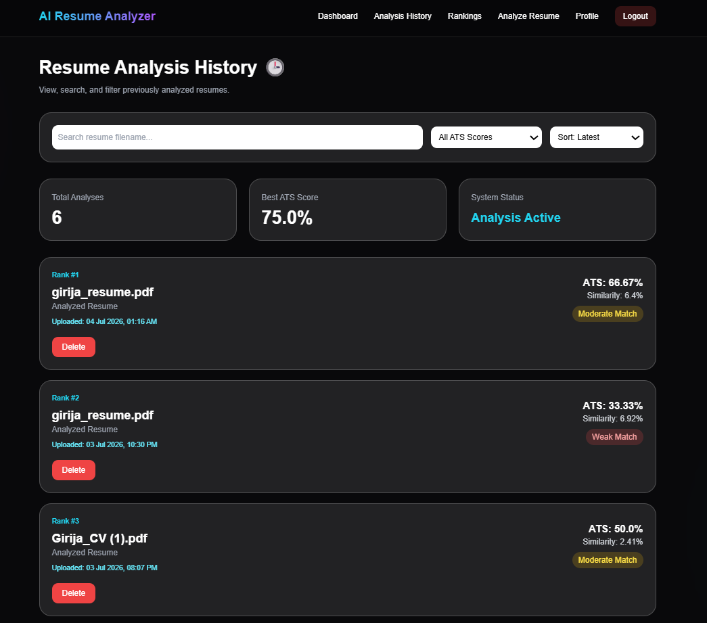
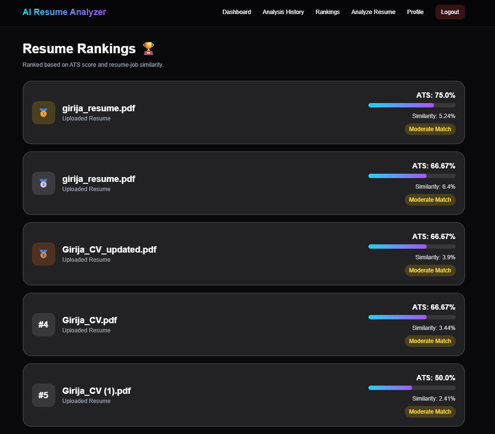
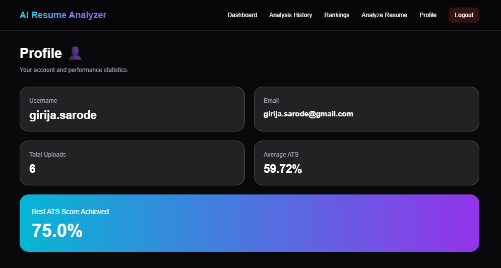

# 🤖 AI Resume Analyzer

An AI-powered web application that analyzes resumes against job descriptions, calculates ATS compatibility, identifies missing skills, generates personalized AI feedback using an LLM, and provides an interactive analytics dashboard.

---

# 📌 Project Overview

**AI Resume Analyzer** helps job seekers evaluate how well their resume matches a given job description.

The application extracts text from uploaded PDF resumes, performs NLP-based skill extraction, calculates ATS and similarity scores, identifies missing skills, generates AI-powered improvement suggestions using **Groq's Llama 3 model**, and stores previous analyses for future reference.

---

# ✨ Features

### 🔐 Authentication

* User Signup & Login
* Secure Password Hashing
* Forgot Password & Reset Password

### 📄 Resume Analysis

* Upload PDF Resume
* Extract Resume Text
* ATS Score Calculation
* Resume–Job Description Similarity Score
* Skill Matching
* Missing Skills Detection

### 🤖 AI Resume Feedback

* Personalized Resume Improvement Suggestions
* LLM-powered feedback using **Groq (Llama 3)**

### 📊 Analytics Dashboard

* Total Resume Analyses
* Average ATS Score
* Average Similarity Score
* Highest ATS Score
* ATS Distribution Chart
* Missing Skills Analytics

### 📚 Analysis History

* View Previous Resume Analyses
* Search History
* Timestamp Tracking

### 🏆 Resume Ranking

* Candidate Ranking based on ATS Score
* Recommendation Labels

### 📑 Report Generation

* Download Resume Analysis Report as PDF

---

# 🛠️ Tech Stack

### Frontend

* HTML5
* Tailwind CSS
* JavaScript
* Chart.js

### Backend

* Python
* Flask

### AI / Machine Learning / NLP

* spaCy
* Scikit-learn
* TF-IDF Vectorizer
* Cosine Similarity
* Groq API
* Llama 3

### Database

* SQLite

### Libraries

* pdfplumber
* Werkzeug
* Jinja2

---

# 🚀 Installation

## Clone the Repository

```bash
git clone https://github.com/girijasarode11-commits/ai-resume-analyzer.git

cd ai-resume-analyzer
```

---

## Create Virtual Environment

```bash
python -m venv venv
```

---

## Activate Virtual Environment

### Windows

```bash
venv\Scripts\activate
```

### Linux / macOS

```bash
source venv/bin/activate
```

---

## Install Dependencies

```bash
pip install -r requirements.txt
```

---

## Download spaCy Model

```bash
python -m spacy download en_core_web_sm
```

---

## Configure Groq API

Create a `.env` file in the project root.

```env
GROQ_API_KEY=your_api_key_here
```

---

## Run the Application

```bash
python app.py
```

Open:

```
http://127.0.0.1:5000
```

---

# 📸 Application Screenshots

## 🔐 Login Page



---

## 📝 Signup Page


---

## 📊 Dashboard



---

## 📄 Resume Analyzer



---

## ✅ Analysis Result



---

## 📚 Analysis History



---

## 🏆 Candidate Rankings



---

## 👤 User Profile



---

# 🎯 Future Enhancements

* Recruiter Dashboard
* Email Notifications
* Resume Version Comparison
* AI-based Interview Question Generator
* Multi-file Resume Ranking
* Docker Support
* Cloud Deployment
* Multi-language Resume Support

---

# 💡 Key Highlights

* AI-powered Resume Analysis
* ATS Compatibility Evaluation
* NLP-based Skill Extraction
* Resume–Job Description Matching
* LLM-powered Resume Feedback
* Interactive Analytics Dashboard
* PDF Report Generation
* Secure User Authentication

---

#  Author

**Girija Sarode**

Final Year Computer Engineering Student

Interested in Artificial Intelligence, Machine Learning, NLP, and Full Stack Development.

GitHub: https://github.com/girijasarode11-commits

---

#  License

This project is developed for educational and learning purposes.
